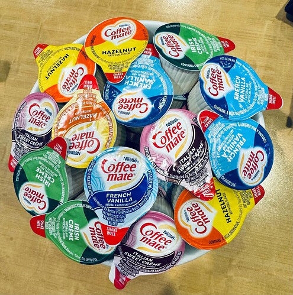
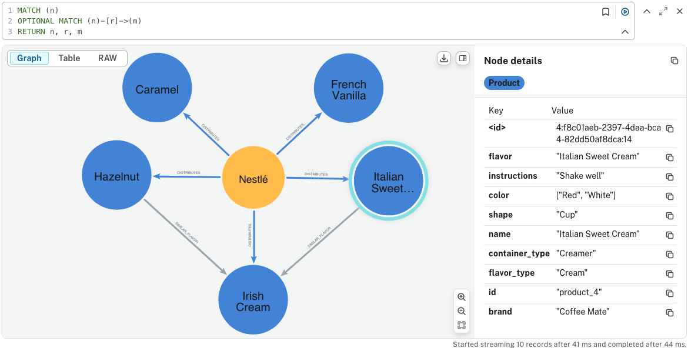

# Neo4j Weekly Graph Contest #1

Contest:

Use the image below as the only input. The goal is to model it as a graph—whatever that means to you. Get clever, get weird, get visual.

Solution:

Use an LLM (OpenAI: gpt-4o-mini) to extract the product information from the image and create a Neo4j KG in AuraDB.

See [Jupyter Notebook](notebooks/contest1.ipynb)

Result:

# neo4j-graph-contest
